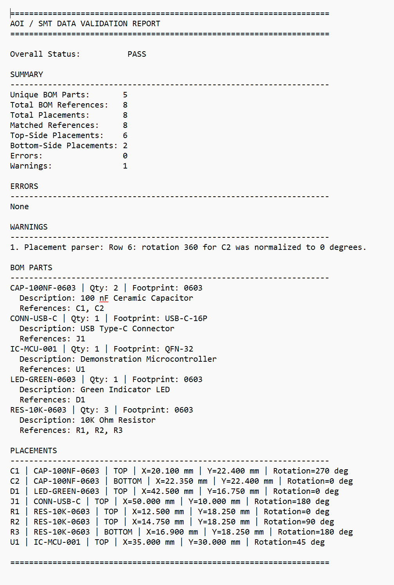

# AOI/SMT Data Validator


A Python-based portfolio project for validating bill-of-material and component-placement data used in AOI, SPI, and SMT programming workflows.

The application compares BOM data against placement data, identifies inconsistencies, normalizes manufacturing information, and generates both human-readable and JSON validation reports.

All products, part numbers, files, and manufacturing data in this repository are fictional and independently created for demonstration purposes.

## Project Purpose

AOI, SPI, and SMT programs frequently depend on multiple manufacturing-data sources, including:

* Bills of materials
* Component-placement files
* Footprint definitions
* Board-side assignments
* Component rotations
* Reference designators
* Part identifiers
* Panel and PCB information

Inconsistencies between these sources can result in:

* Missing components
* Duplicate placements
* Incorrect footprints
* Invalid rotations
* Top- and bottom-side programming errors
* Incorrect part assignments
* Incomplete inspection coverage
* Import failures
* Inconsistent machine programs

This project demonstrates how manufacturing data can be parsed, normalized, compared, validated, and reported before being imported into AOI, SPI, or SMT programming software.

## Current Capabilities

### BOM Processing

* Parses BOM data from CSV files
* Groups reference designators by part ID
* Normalizes part IDs
* Normalizes reference designators
* Calculates quantity from grouped references
* Detects duplicate reference designators
* Detects references assigned to multiple part IDs
* Detects conflicting part descriptions
* Detects conflicting footprint definitions
* Reports missing descriptions
* Reports missing footprints
* Validates required CSV columns

### Placement Processing

* Parses component-placement data from CSV files
* Validates X coordinates
* Validates Y coordinates
* Validates component rotations
* Validates top- and bottom-side assignments
* Normalizes rotations to a range of 0 through 359 degrees
* Detects duplicate placements
* Detects missing coordinates
* Detects nonnumeric coordinates
* Detects nonnumeric rotations
* Detects invalid board-side values
* Reports missing footprint information
* Validates required CSV columns

### BOM-to-Placement Validation

* Detects BOM references missing from placement data
* Detects placements missing from the BOM
* Detects part-ID mismatches
* Detects footprint mismatches
* Consolidates parser errors
* Consolidates parser warnings
* Tracks correctly matched reference designators
* Produces an overall pass/fail result

### Reporting

* Displays a formatted validation report in the terminal
* Generates a plain-text report
* Generates a structured JSON report
* Summarizes:

  * Unique BOM parts
  * Total BOM references
  * Total placements
  * Matched references
  * Top-side placements
  * Bottom-side placements
  * Errors
  * Warnings

### Command-Line Interface

The validator can be executed from PowerShell or another terminal using two CSV input files.

The command-line interface supports:

* BOM file selection
* Placement file selection
* Terminal report output
* Optional text-report output
* Optional JSON-report output
* Exit codes suitable for automation and CI workflows

### Automated Testing

The project includes automated tests for:

* BOM parsing
* Placement parsing
* Data normalization
* Duplicate detection
* Missing-column detection
* Missing-coordinate handling
* Invalid numeric-value handling
* Invalid board-side handling
* Rotation normalization
* Part-ID comparison
* Footprint comparison
* Missing BOM references
* Unexpected placements
* Text-report generation
* JSON-report generation
* Parser-error propagation
* Warning propagation

### Continuous Integration

GitHub Actions automatically runs the complete test suite for:

* Python 3.11
* Python 3.12
* Python 3.13

Tests run on every push to `main` and on every pull request targeting `main`.

## Repository Structure

```text
aoi-smt-data-validator/
├── .github/
│   └── workflows/
│       └── python-tests.yml
├── .gitignore
├── README.md
├── requirements.txt
├── sample_data/
│   ├── demo_bom.csv
│   └── demo_placements.csv
├── screenshots/
├── src/
│   └── aoi_validator/
│       ├── __init__.py
│       ├── bom_parser.py
│       ├── cli.py
│       ├── placement_parser.py
│       ├── report.py
│       └── validator.py
└── tests/
    ├── test_bom_parser.py
    ├── test_placement_parser.py
    ├── test_report.py
    └── test_validator.py
```

## Requirements

* Python 3.11 or newer
* `pytest` for automated testing
* Git for cloning and source control

## Installation

Clone the repository:

```powershell
git clone https://github.com/JustinGottliebEngineering/aoi-smt-data-validator.git
cd aoi-smt-data-validator
```

Create a virtual environment:

```powershell
py -m venv .venv
```

Activate the virtual environment:

```powershell
.\.venv\Scripts\Activate.ps1
```

Install the required packages:

```powershell
python -m pip install -r requirements.txt
```

Set the source directory on the Python path for the current PowerShell session:

```powershell
$env:PYTHONPATH = "$PWD\src"
```

## Running the Tests

Run the complete automated test suite:

```powershell
python -m pytest -v
```

All tests should pass before modifying or extending the application.

Example successful output:

```text
============================= test session starts =============================
collected 23 items

tests/test_bom_parser.py ........
tests/test_placement_parser.py ........
tests/test_report.py ....
tests/test_validator.py .......

============================= 23 passed ======================================
```

The exact test count may increase as additional functionality is added.

## Usage

Run the validator against the included fictional sample files:

```powershell
python -m aoi_validator.cli `
    sample_data\demo_bom.csv `
    sample_data\demo_placements.csv
```

Generate both a text report and a JSON report:

```powershell
python -m aoi_validator.cli `
    sample_data\demo_bom.csv `
    sample_data\demo_placements.csv `
    --text-report output\validation_report.txt `
    --json-report output\validation_report.json
```

Generated files:

```text
output/
├── validation_report.json
└── validation_report.txt
```

The `output` directory is excluded from source control because it contains generated report files.

## Exit Codes

The command-line interface returns:

| Exit Code | Meaning                                          |
| --------: | ------------------------------------------------ |
|       `0` | Validation completed successfully with no errors |
|       `1` | Validation completed and data errors were found  |
|       `2` | An input file could not be opened or parsed      |

These exit codes allow the validator to be incorporated into automated workflows.

## Example Output

```text
====================================================================
AOI / SMT DATA VALIDATION REPORT
====================================================================

Overall Status:          PASS

SUMMARY
--------------------------------------------------------------------
Unique BOM Parts:       5
Total BOM References:   8
Total Placements:       8
Matched References:     8
Top-Side Placements:    6
Bottom-Side Placements: 2
Errors:                 0
Warnings:               1

ERRORS
--------------------------------------------------------------------
None

WARNINGS
--------------------------------------------------------------------
1. Placement parser: Row 6: rotation 360 for C2 was normalized to 0 degrees.
```

A normalized rotation warning does not cause the overall validation to fail.

## Input File Formats

### BOM CSV

Required columns:

```csv
part_id,reference,description,footprint
```

Example:

```csv
part_id,reference,description,footprint
RES-10K-0603,R1,10K Ohm Resistor,0603
RES-10K-0603,R2,10K Ohm Resistor,0603
RES-10K-0603,R3,10K Ohm Resistor,0603
CAP-100NF-0603,C1,100 nF Ceramic Capacitor,0603
CAP-100NF-0603,C2,100 nF Ceramic Capacitor,0603
IC-MCU-001,U1,Demonstration Microcontroller,QFN-32
LED-GREEN-0603,D1,Green Indicator LED,0603
CONN-USB-C,J1,USB Type-C Connector,USB-C-16P
```

### Placement CSV

Required columns:

```csv
reference,part_id,footprint,side,x_mm,y_mm,rotation_deg
```

Example:

```csv
reference,part_id,footprint,side,x_mm,y_mm,rotation_deg
R1,RES-10K-0603,0603,TOP,12.500,18.250,0
R2,RES-10K-0603,0603,TOP,14.750,18.250,90
R3,RES-10K-0603,0603,BOTTOM,16.900,18.250,180
C1,CAP-100NF-0603,0603,TOP,20.100,22.400,270
C2,CAP-100NF-0603,0603,BOTTOM,22.350,22.400,360
U1,IC-MCU-001,QFN-32,TOP,35.000,30.000,45
D1,LED-GREEN-0603,0603,TOP,42.500,16.750,0
J1,CONN-USB-C,USB-C-16P,TOP,50.000,10.000,180
```

Valid board-side values are:

```text
TOP
BOTTOM
```

Rotations outside the standard range are normalized.

Examples:

| Input Rotation | Normalized Rotation |
| -------------: | ------------------: |
|          `360` |                 `0` |
|          `450` |                `90` |
|          `-90` |               `270` |
|          `720` |                 `0` |

## Example Validation Conditions

### Missing Placement

```text
Reference R2 is listed in the BOM as part RES-10K-0603 but is missing from the placement data.
```

### Unexpected Placement

```text
Reference C4 appears in the placement data as part CAP-100NF-0603 but is not listed in the BOM.
```

### Part-ID Mismatch

```text
Reference U1 has part ID IC-DEMO-002 in placement data but IC-DEMO-001 in the BOM.
```

### Footprint Mismatch

```text
Reference R1 has footprint 0805 in placement data but 0603 in the BOM.
```

### Duplicate Reference

```text
Reference R1 is assigned to both RES-10K-0603 and RES-1K-0603.
```

### Invalid Side

```text
Side must be TOP or BOTTOM; received 'LEFT'.
```

### Missing Coordinate

```text
x_mm is blank.
```

### Rotation Normalization

```text
Rotation 360 for C2 was normalized to 0 degrees.
```

## Engineering Concepts Demonstrated

This project demonstrates:

* Python package organization
* Modular application design
* CSV parsing
* Data normalization
* Dataclasses
* Type hints
* Exception handling
* Cross-file validation
* Set-based comparison
* Dictionary-based indexing
* Human-readable reporting
* JSON serialization
* Command-line interface development
* Exit-code handling
* Automated testing with `pytest`
* GitHub Actions continuous integration
* Manufacturing-data workflow analysis
* AOI programming concepts
* SPI programming concepts
* SMT placement-programming concepts

## Manufacturing Context

AOI and SMT program generation often involves reconciling data from multiple engineering and manufacturing systems.

Typical challenges include:

* Different part-number formats
* Duplicate reference designators
* Conflicting footprint names
* Missing bottom-side placements
* Incorrect rotations
* Inconsistent board-side naming
* BOM and centroid-file mismatches
* Missing panel fiducials
* Panel-step and PCB-step confusion
* Incomplete component-library information

This project is intended to demonstrate a structured software approach to detecting these conditions before manufacturing programs are generated or imported.

## Planned Improvements

Future development may include:

* Reference-designator format validation
* Natural sorting of reference designators
* Panel and PCB step validation
* Panel-fiducial validation
* Board-fiducial validation
* Duplicate part-definition reporting
* Configurable rotation rules
* Bottom-side rotation conversion rules
* Coordinate-unit conversion
* Millimeter and inch support
* Configurable CSV column mapping
* BOM quantity-column comparison
* Component-type classification
* Do-not-place component handling
* ODB++ data abstraction
* Gerber-related metadata checks
* Panel-placement support
* Graphical top-side placement map
* Graphical bottom-side placement map
* Interactive Flask interface
* Drag-and-drop file selection
* Browser-based validation reports
* Downloadable report files
* Windows executable packaging
* Code-coverage reporting
* Static type checking
* Additional GitHub Actions quality checks

## Confidentiality and Data Policy

This repository does not contain:

* Employer-owned source code
* Customer information
* Customer assemblies
* Production BOMs
* Production placement files
* Gerber data
* ODB++ archives
* Firmware
* Product drawings
* Internal network information
* Credentials
* Access tokens
* Proprietary equipment configurations
* Confidential manufacturing procedures

All sample information was created specifically for this public demonstration.

The project was developed independently as a clean-room portfolio example and does not reproduce an employer-owned application.

## Professional Context

This project reflects practical experience with:

* AOI and SPI program development
* SMT placement-machine programming
* BOM and placement-data troubleshooting
* Component-footprint management
* Top- and bottom-side component validation
* Panel and PCB manufacturing workflows
* ODB++, Gerber, BOM, and centroid data
* Python-based production automation
* Manufacturing test engineering
* Production process improvement

Most production engineering applications developed during my professional work are maintained in private employer-owned repositories. This public repository demonstrates related engineering concepts using fictional data and independently written code.

## Project Status

Version `0.1.0` includes:

* BOM parsing
* Placement parsing
* BOM-to-placement cross-validation
* Text reporting
* JSON reporting
* Command-line execution
* Automated tests
* GitHub Actions continuous integration
* Fictional sample data
* Public technical documentation

The project is under active development as part of a professional manufacturing-test engineering portfolio.

## Screenshot


